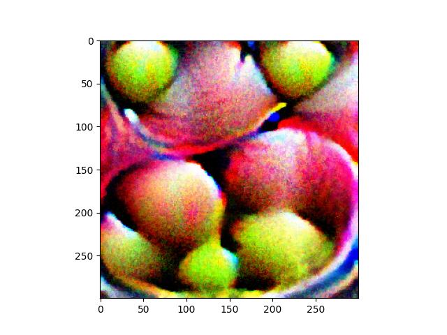

# CSE 569 Lab 2 - Physical Adversarial Machine Learning

Hayden Schroeder - April 2024

## Adversarial Machine Learning Overview

The adversarial machine learning works by creating an adversarial model which is trained to generate adversarial examples that can fool the target model.

## Implementation and Experiment

### Initial setup

### Testing the target model

### Training the adversarial model

## Conclusion and Limitations

Running out of colab compute hours became a huge issue for me. I was unable to finish the lab in time due to this constraint.